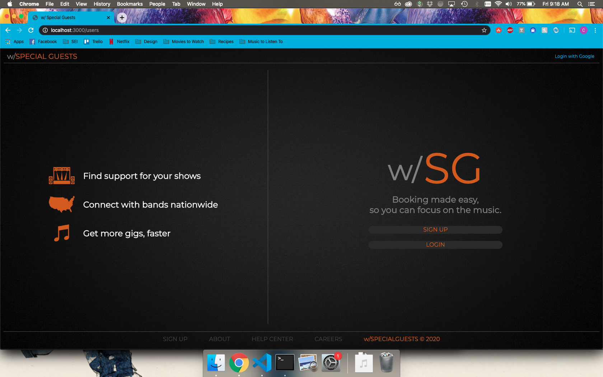
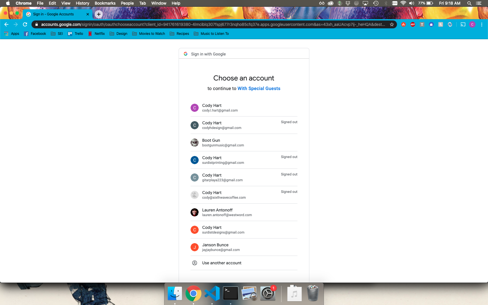
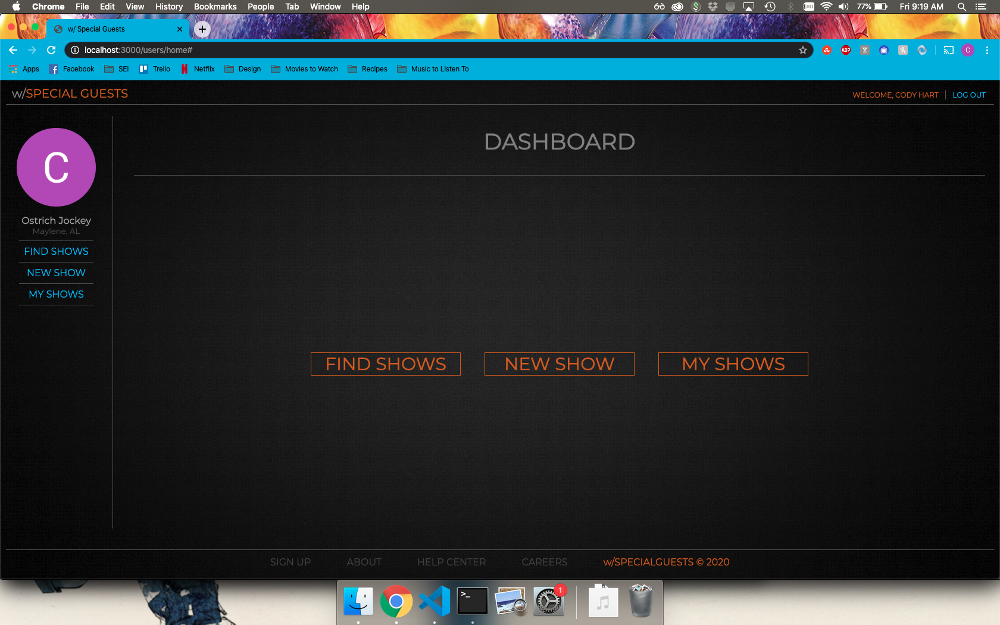
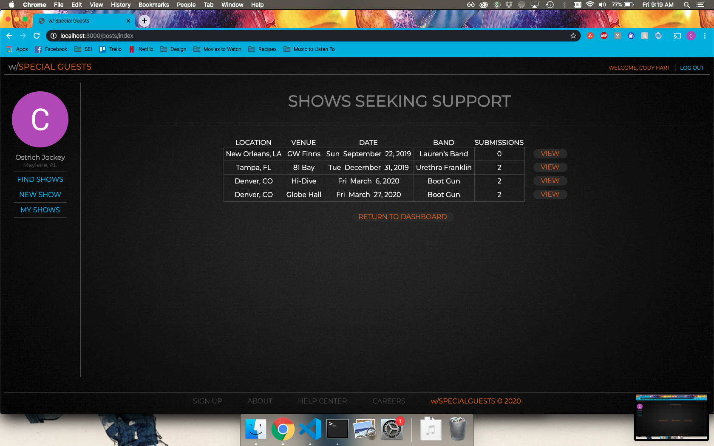
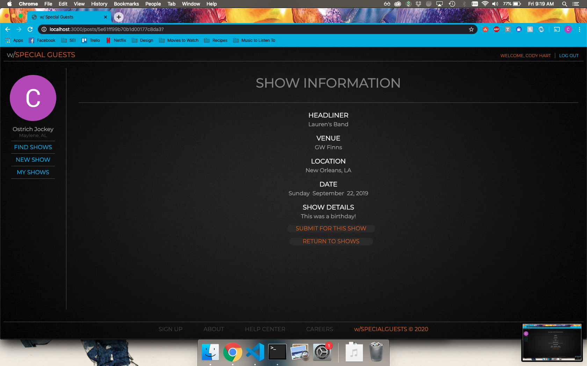
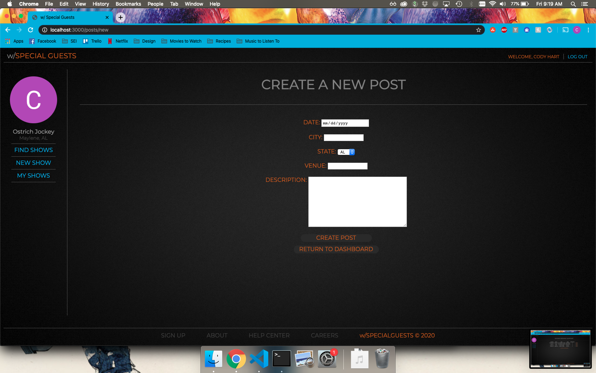
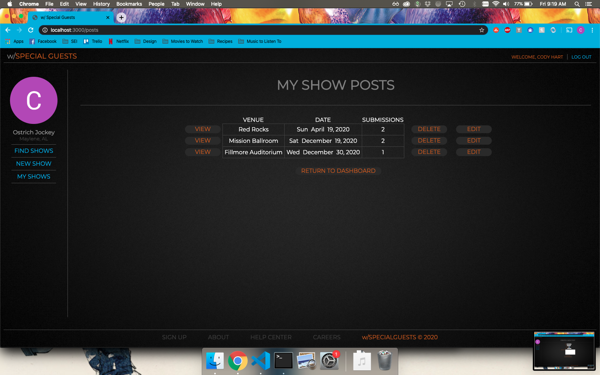
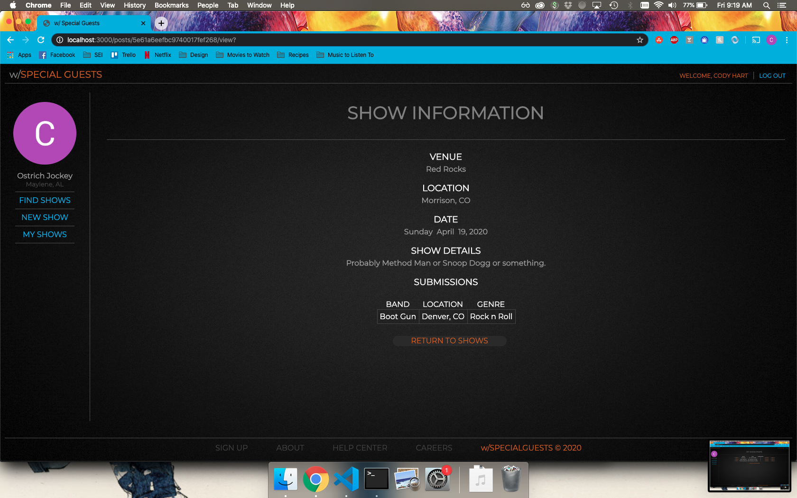
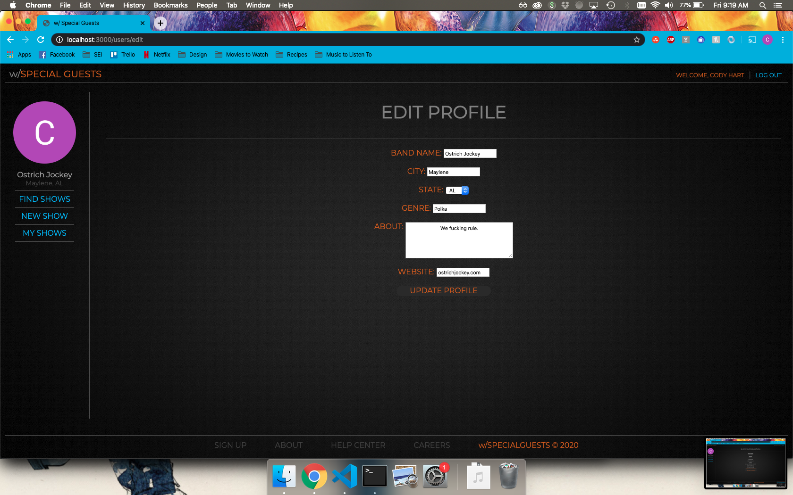

# WITH SPECIAL GUESTS

With Special Guests is a social network intended specifically for bands. The purpose of the app is to allow bands that are seeking support for their shows to create a post and allow other bands to submit themselves for consideration for the available support position. In future versions of the app, venues will be allowed to create premium profiles to allow them the opportunity to find more high quality bands without a dedicated talent buyer. 

---

## TECHNOLOGIES USED
HTML, CSS, Javascript, NodeJS, Express, MongoDB, Mongoose, Adobe Illustrator

---
## GETTING STARTED

### PLANNING
[User Stories and Wireframes](https://trello.com/b/Y4sTacqc/with-special-guests)

[Models and ERD](https://trello.com/b/YplM24Tr/with-special-guests-models)

---
[Check Out The App Here!](https://with-special-guests.herokuapp.com/)

To begin, log in with your Google account. Once logged in, the app will prompt you to create a profile. Once your profile is created, you can go to "Find Shows" to view all show posts made by other bands. On this page, you can viewmore information about the show and submit your band for that show. To create a show post, you can go to "New Show" and put the show information into the form provided. To view and edit your own shows, you can go to "My Shows" and update any information about your show as well as view all of the bands that have submitted on your show post. To edit your profile, simply click on your band name in the navigation on the left side. To return to your dashboard, simply click on the w/SPECIALGUESTS logo in the top left corner.

---
## NEXT STEPS
I have a number of ideas for future enhancements for this app. The next steps are to allow for bands to see more information about the bands that have submit for their shows, mostly focused on a full profile page for each band. In addition to this, I would like to add venue information for the venues in each city that the app is implemented (starting with Denver), and change the show post form to have bands select from a list of available venues. After that I will add the functionality for a venue to create their own profile so venues without a dedicated talent buyer can have an easy resource for booking bands. The last main feature I want to implement is the ability for bands (and eventually venues) to engage in communications through a messaging sysyem. 